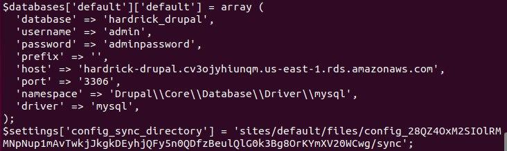
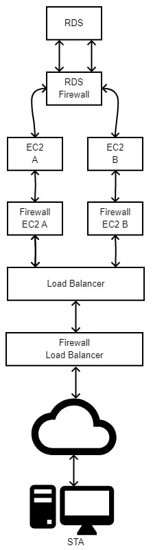

# Lab 02 - Cloud Computing

Author : Baptiste Hardrick & David Jaquet

## Create a database using the RDS

- TODO : REMOVE CREDS
  
- credential for the DB :
  
  - First
    - username : admin
    - pwd : adminpassword
  - Second
    - Username : newadmin
    - pwd : newadminpassword
  
  
  
- Copy the estimated costs you calculated and add it to your report.

  - As you can see below, the estimated costs is about **$ 14.71** by month

    

- Compare the costs of your RDS instance to a continuously running EC2 instance of the same size using the AWS calculator. (Don't forget to uncheck the **Free Usage Tier** checkbox at the top.)

  - As you can see below, we use an EBS Volume of **20 GB** an it costs **$ 10.50**. The RDS instance is more expensive.

    

    

- In a two-tier architecture the web application and the database are kept separate and run on different hosts. Imagine that for the second tier instead of using RDS to store the data you would create a virtual machine in EC2 and install and run yourself a database on it. If you were the Head of IT of a medium-size business, how would you argue in favor of using a database as a service instead of running your own database on an EC2 instance? How would you argue against it?

  - Using RDS is better than an a database for multiple reasons :
    - The execution of queries is faster.
    - Best tuples indexing
    - We can easily create some relation between 2 tables
    - RDS handle concurrency, so multiple users can access to the databases at the same time
    - RDS handle large datasets more easily
    - It scales well

- Copy the endpoint address of the database into the report.

  - The endpoint address of the database is [hardrick-drupal.cv3ojyhiunqm.us-east-1.rds.amazonaws.com](hardrick-drupal.cv3ojyhiunqm.us-east-1.rds.amazonaws.com)

## Configure the Drupal master instance to use the RDS database

- Copy the part of **settings.php** that configures the database into the report.

  - You can find below a screenshot of the **settings.php** file :

    

## Create a custom virtual

- Copy a screenshot of the AWS console showing the AMI parameters into the report.

  - You can find below a screenshot of the AWS console with the AMI parameters :

    

## Create a load balancer

- On your local machine resolve the DNS name of the load balancer into an IP address using the nslookup command (Linux or Windows). Write the DNS name and the resolved IP Address(es) into the report.

  - As you can see in screenshot below, the DNS name of our load balancer is [hardrick-loadBalancer-410735606.us-east-1.elb.amazonaws.com](hardrick-loadBalancer-410735606.us-east-1.elb.amazonaws.com) and the IP addresses are `52.7.249.117` and `52.6.4.29`.

    

- In the Apache access log identify the health check accesses from the load balancer and copy some samples into the report.

  - You can fin below the messages of the load balancer's health check. The messages have been record in the logs.

    

## Launch a second instance from the custom image

- Draw a diagram of the setup you have created showing the components (instances, database, load balancer, client) and how they are connected. Include the security groups as well.

  - Below, the diagram :

    

- Using the [Simple Monthly Calculator](http://calculator.s3.amazonaws.com/calc5.html) calculate the monthly cost of this setup. You can ignore traffic costs. (Make sure you don't forget to include a component in the calculation. Also don't forget to uncheck the **Free Usage Tier** checkbox at the top.)

  - Below the total cost :

    

## Test the distributed application

- Document your observations. Include screenshots of JMeter and the AWS console monitoring output.

- When you resolve the DNS name of the load balancer into IP addresses while the load balancer is under high load what do you see? Explain.

  - As you can see in the screenshot below, we can't get the IP addresses associate to the load balancer. The Load balancer cannot be reached.

    

- Did this test really test the load balancing mechanism? What are the limitations of this simple test? What would be necessary to do realistic testing?

